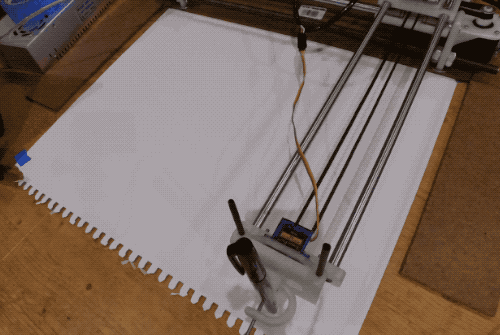

# 4xidraw-OSM

Have your robot draw parts of OpenStreetMap (OSM).

## Building a Docker image

The goal of this system is to enable rapid creation of SVGs from a given OSM extract without tediously reloading data, then to send that SVG data to a 4xiDraw plotter robot. The [4xiDraw is an open design](www.instructables.com/id/4xiDraw/) that lets anyone build their own plotter.

This system consists of a few parts:

- a Docker-based mechanism for creating SVGs from OSM extracts
- an improved version of the 4xiDraw Inkscape plugin for converting SVGs to gcode
- a post-processing script to rationalize separate gcode files from multilayer SVGs

### Building the base image (optional)

You probably don't have to do this -- you should be able to pull the prebuilt image from Docker Hub. But for the record:

```
docker build -t sbma44/4xidraw-osm:base -f Dockerfile.base .
```

### OK, here's the important part

When building, you must specify which OSM extract(s) your image will store. You can do so by passing in comma-separated links to one or more .osm.bz2 extract(s) of an OSM region, like the ones supplied by geofabrik:

```
docker build -t sbma44/4xidraw-osm:new-york --build-arg DOWNLOAD=http://download.geofabrik.de/north-america/us/new-york-latest.osm.bz2 .
```

## Generating an SVG

With the Docker image built, you can run the task by passing in a [GeoJSON](https://geojson.io) bounding box for the area you're interested in and an output path.

### Storing output locally

Local output is enabled by using Docker's `-v` flag to map a local folder to the Docker container's filesystem, like so:

```
docker run -v /path/to/my/output:/tmp/out sbma44/4xidraw-osm:new-york '{"type":"Polygon","coordinates":[[[-74.09,40.71],[-74.01,40.71],[-74.01,40.78],[-74.09,40.78],[-74.09,40.71]]]}' /tmp/out
```

Note that in the above example, `/tmp/out` is the path used within the container. In general, you should not change this value. `/path/to/my/output` is the local path where you can retrieve your SVG after the process has completed.

### Storing output on S3

If you pass in AWS credentials as environment variables and specify an S3 path as the output location, the result will be compressed and placed on S3:

```
docker run -e AWS_ACCESS_KEY_ID=ABCDEFGHIJKLM -e AWS_SECRET_ACCESS_KEY=1234567890 sbma44/4xidraw-osm:new-york '{"type":"Polygon","coordinates":[[[-74.09,40.71],[-74.01,40.71],[-74.01,40.78],[-74.09,40.78],[-74.09,40.71]]]}' 's3://my-output-bucket'
```

### Overriding layer selection (advanced)

By default, your output SVG will contain layers for streets, buildings, train tracks and bicycle paths. It's possible to specify your own selection criteria by passing the container an environment variable named `LAYERS` in the format: `LAYER_NAME|TABLE_NAME|WHERE_CLAUSE`. Here's an example:

```
highway|planet_osm_line|highway IS NOT NULL
bicycle|planet_osm_line|route='bicycle'
train|planet_osm_line|route='train'
building|planet_osm_polygon|building IS NOT NULL
```

This feature assumes familiarity with the default table schema created by the [osm2pgsql](https://wiki.openstreetmap.org/wiki/Osm2pgsql) tool.

## Using Inkscape

The Docker container will create SVGs intended for further editing in Inkscape.

### Setup

- Copy `inkscape/4xidraw.*` to the [Inkscape extensions directory](https://inkscape.org/en/gallery/%3Dextension/).
- Restart Inkscape.

### Using an SVG

1. Open the SVG file.
2. Open `Document Properties` (ctrl + shift + d). Change `Units` to `px`. `Default Units` can be any value, but `mm` is recommended.
3. Select all paths (ctrl + alt + a) and scale them to the dimensions you want. My 4xiDraw's maximum safe print area is 280mm x 280mm.
4. Open the `Layers` dialog (shift + ctrl + l). Select a desired layer. Select all paths within the layer (ctrl + a).
5. Go to `Extensions > 4xiDraw > 4xiDraw Exporter...`
6. Specify a filename and output directory. Other defaults should be fine. Hit OK.
7. You now have a mostly-printable gcode file!

## Postprocessing

Unless you have been unusually lucky in Inkscape, the generated gcode often has an offset from the top left of the printable area, aka the origin. This can result in jobs that go out of bounds, damaging your machine. For this reason I have created `rationalize_gcode.py`, which processes one or more gcode files and translates all coordinates to use a minimum of 0, 0.

Why not integrate this logic into the exporter plugin? Simple: the plugin is designed to work with a single layer at a time. Translating layers independently would shift them out of alignment with one another.

You can use the script like so:

```
python3 /path/to/rationalize_gcode.py /path/to/gcode/*.g
```

This will create new versions of each file in your current directory, each with the new suffix `.translated.g`.

## Sending to 4xiDraw

At the recommendation of the 4xiDraw docs, I've been using [Universal Gcode Sender](https://winder.github.io/ugs_website/) (UGS). I recommend version 1.0.9 or higher.

To use, open the application according to its instructions and connect to the 4xiDraw serial port at 115200 baud. Use the manual machine controls with a small step size (e.g. 10mm) and the `X-` and `Y-` buttons to job the pen holder to the point in its range furthest from the Arduino. At this point, hit the `Reset Zero` button. You have just defined the 0,0 origin point for your print.

Now you can use the UGS file sending mode to run a print using your generated gcode. Hit the `Return to Zero` button between each print.

I strongly recommend using the `Visualize` option to determine if there are any unexpected offsets in your gcode -- failure to do so can damage your machine.

## License

It's important to note that OpenStreetMap data is licensed under the [Open Database License (ODbL)](https://www.openstreetmap.org/copyright). The ODbL carries attribution requirements that are likely to apply to works produced with this software, including drawings made by a 4xiDraw or any redistribution of Docker images containing loaded OSM data. It is your responsibility to understand and comply with these requirements; please be sure to familiarize yourself with them.

Wherever possible the code in this repo is published under the BSD license. Please see [LICENSE.md](LICENSE.md) for more details. Please take careful note of the disclaimers present in that file, as sending your 4xiDraw bad gcode can damage the machine and objects in its vicinity. This code was written for my own use, for which it has proven satisfactory. But I cannot and will not accept responsibility for its use or any damage or injury that might result. Please do not use this code if you are unwilling to assume this risk.